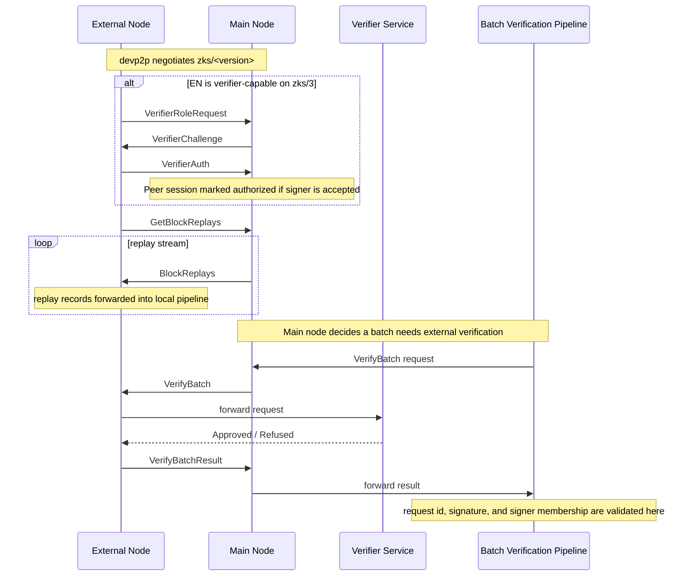

# devp2p / `zks` Protocol

The `lib/network` crate integrates ZKsync OS-specific peer-to-peer traffic into the node's
devp2p / RLPx network stack.

Its purpose is not to replace the node's general networking. Instead, it adds a `zks/<version>`
subprotocol that is used for two zkSync OS-specific flows:

1. replay streaming from a main node to an external node
2. batch-verification request / response exchange between a main node and verifier-capable
   external nodes

## High-level model

At runtime, each node is configured locally as either:

- a `MainNode`
- an `ExternalNode`

That local role determines how the node behaves on each negotiated `zks` connection:

- the main node serves replay data and receives `VerifyBatchResult`
- the external node requests replay data and may optionally authenticate as a verifier

There is currently no explicit "remote role negotiation" on top of devp2p. The local node chooses
its behavior from config and then expects the remote peer to behave compatibly on the negotiated
`zks` connection.

## Module split

- `service.rs`
  Owns the network manager, registers `zks` protocol handlers, consumes protocol events, tracks
  peer sessions, and dispatches `VerifyBatch` requests to eligible peers.
- `protocol/`
  Contains the RLPx subprotocol implementation itself.
  - `handler.rs`: bridges reth's protocol hooks into per-connection tasks
  - `mn.rs`: main-node side of one `zks` connection
  - `en.rs`: external-node side of one `zks` connection
  - `events.rs`: protocol events and live connection handles
  - `handler_shared_state.rs`: shared handler runtime state such as the active-connection limit
- `session.rs`
  Tracks higher-level peer session facts derived from protocol events, such as replay progress and
  verifier authorization state.
- `wire/`
  Defines the `zks` wire messages carried over devp2p.

## Replay flow

Replay is the baseline `zks` protocol behavior.

1. The EN negotiates a `zks/<version>` capability over devp2p.
2. The EN sends `GetBlockReplays`.
3. The MN streams `BlockReplays`.
4. The EN forwards received replay records into its local pipeline.

Replay record encoding is versioned. Older protocol versions only support replay transport.

## Batch verification flow

`zks/3` adds verifier-related messages on top of replay streaming.

1. An EN that is configured as a verifier sends `VerifierRoleRequest`.
2. The MN replies with `VerifierChallenge`.
3. The EN signs the challenge and sends `VerifierAuth`.
4. The MN emits authorization events and tracks verifier eligibility for that peer session.
5. When the MN wants external verification for a batch, `service.rs` selects eligible peers and
   sends `VerifyBatch` over live `zks/3` connections.
6. The EN-side verifier validates the request and sends back `VerifyBatchResult`.
7. The MN forwards those results into the batch-verification pipeline, which validates request ids,
   signatures, and signer membership before counting them.

### Sequence

## Why session tracking exists

The network service needs more than "is this peer connected right now?"

For verification dispatch, it needs to know whether a peer:

- requested replay
- has been sent replay far enough to verify a given batch
- successfully authenticated as a verifier on the current connection

That derived state is kept in `PeerSessionStore`. Live send handles stay in the connection
registry. Dispatch joins those two views:

- `PeerSessionStore` answers "who is eligible?"
- `ConnectionRegistry` answers "how do I send to them right now?"
