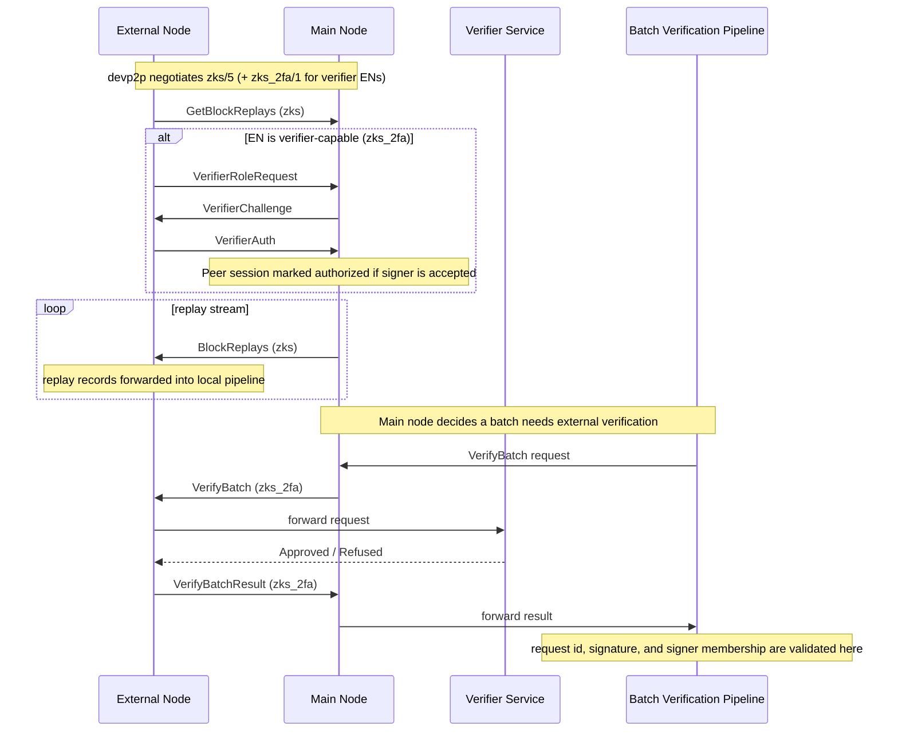

# devp2p / `zks` Protocols

The `lib/network` crate integrates ZKsync OS-specific peer-to-peer traffic into the node's
devp2p / RLPx network stack.

Its purpose is not to replace the node's general networking. Instead, it adds two subprotocols
multiplexed over the same RLPx connection:

1. `zks/<version>` — replay streaming from a main node to an external node
2. `zks_2fa/1` — batch-verification request / response exchange between a main node and
   verifier-capable external nodes

## High-level model

At runtime, each node is configured locally as either:

- a `MainNode`
- an `ExternalNode`

That local role determines how the node behaves on each negotiated connection:

- the main node serves replay data over `zks` and receives `VerifyBatchResult` over `zks_2fa`
- the external node requests replay data over `zks` and, if configured as a verifier, advertises
  `zks_2fa` and authenticates on it

There is no explicit "remote role negotiation" on top of devp2p. The local node chooses its
behavior from config and then expects the remote peer to behave compatibly on the negotiated
connections.

## Supported versions

- `zks/5` — the only production version registered by the Syscoin network service. It uses
  upstream's replay-only message surface (`GetBlockReplays` 0x00 and `BlockReplays` 0x01) and
  canonical v3 replay record encoding.
- `zks/0` — a bare-bones version kept in-tree for tests only. Its replay records carry just the
  block number, and the network service never registers it.
- `zks/1`–`zks/4` are retired and no longer accepted. `zks/3` and `zks/4` carried the verifier
  messages inline at message IDs 0x02–0x06; those IDs are not reused in replay-only `zks/5`.
  Their record implementations are removed; the production service does not register those
  protocol versions.
- `zks_2fa/1` — hosts the verifier handshake (`VerifierRoleRequest` 0x00, `VerifierChallenge`
  0x01, `VerifierAuth` 0x02) and batch verification (`VerifyBatch` 0x03, `VerifyBatchResult`
  0x04). Only verifier-configured ENs advertise it; the main node always does. **SYSCOIN:** This
  capability has not been released or deployed: its first supported authentication semantics use
  the peer-bound V2 transcript described below, so there is no compatibility lane for the earlier
  draft behavior.

The `zks` subprotocol is mandatory: a peer that does not share any registered `zks` version
(e.g. a retired `zks/1`–`zks/4`-only peer, or a plain `eth` peer) is disconnected during the
RLPx handshake. **SYSCOIN:** `zks_2fa` is optional: absence, negotiation rejection, local
authorization policy, clean local shutdown, and closed local channels preserve replay. Peer
protocol faults, transient handshake timeouts, full bounded channels, an admitted request timeout,
or loss of an already-consumed result instead perform the exact-connection liveness reset described
below so the optional capability is renegotiated rather than parked permanently.

## Version lifecycle

Deployed peers negotiate a specific `zks/N` capability, so versions must evolve additively:

1. **Never change the wire behavior of a registered version.** Renumbering, stripping messages,
   or altering the record encoding of an existing version silently breaks mixed old/new fleets.
   Any change to the message surface or record encoding gets a NEW version (and, for record
   changes, a new `wire/replays/v*.rs` file) registered alongside the existing ones.
2. **Keep old versions registered through the transition.** RLPx negotiates the highest common
   version, so new↔new pairs use the new path while new↔old pairs keep working on the old one.
3. **Removing old versions is a separate, breaking change** (`feat!` with rollout instructions),
   shipped only once every deployed peer — including third-party ENs — runs a release that
   speaks the newer version. It is never done as a side effect of another change.
4. **Retired version numbers and message IDs are never reused.**

History: upstream `zks/1` through `zks/4` carried replay, with verifier messages inline in
`zks/3`/`zks/4`. Upstream moved verifier traffic to `zks_2fa/1` and defined replay-only `zks/5`
with the v3 record encoding. The fresh Syscoin V32 lane uses that format directly; historical V31
databases and replay encodings are not deployment inputs.

## Module split

- `service.rs`
  Owns the network manager, registers the `zks` and `zks_2fa` protocol handlers, consumes protocol
  events, tracks peer sessions, and dispatches `VerifyBatch` requests to eligible peers over their
  `zks_2fa` connections.
- `protocol/`
  Contains the `zks` RLPx subprotocol implementation itself.
  - `handler.rs`: bridges reth's protocol hooks into per-connection tasks
  - `mn.rs`: main-node side of one `zks` connection
  - `en.rs`: external-node side of one `zks` connection
  - `events.rs`: protocol events
  - `handler_shared_state.rs`: shared handler runtime state such as the active-connection limit
- `twofa/`
  Contains the `zks_2fa` RLPx subprotocol: verifier handshake and batch verification transport,
  plus the registry of live `zks_2fa` connections used for dispatch.
- `session.rs`
  Tracks higher-level peer session facts derived from protocol events, such as replay progress and
  verifier authorization state.
- `wire/`
  Defines the wire messages carried over devp2p (shared payload types are reused by `zks_2fa`).

## Replay flow

Replay is the `zks` protocol's sole responsibility.

1. The EN negotiates a `zks/<version>` capability over devp2p.
2. The EN sends `GetBlockReplays`, including how many records the MN may batch per response.
3. The MN streams `BlockReplays`. Syscoin currently emits one record per frame even when the EN
   requests more, keeping large transaction and preimage payloads under replay-specific
   backpressure without shrinking the control-message queue.
4. The EN forwards received replay records into its local pipeline.

Replay record encoding is versioned separately from the protocol version (`wire/replays/v*.rs`).
Syscoin `zks/5` pins the upstream v3 encoding; upgrade identity comes from the transaction the
guest executes rather than a parallel replay side channel.

## Batch verification flow

Batch verification lives in the standalone `zks_2fa` subprotocol. Peers are correlated across the
two subprotocols by their devp2p `PeerId`.

1. An EN that is configured as a verifier advertises `zks_2fa` and sends `VerifierRoleRequest`.
2. The MN replies with `VerifierChallenge`.
3. The EN signs the V2 transcript
   `keccak256("zksync-os:verifier-auth:v2" || chain ID (BE32) || main-node PeerId || verifier PeerId || nonce)`
   and sends the resulting recoverable signature in `VerifierAuth`. The execution chain ID and both
   ordered peer identities are local connection facts, not peer-supplied auth-message fields. This
   prevents relaying one response onto another chain or peer pair when operators reuse keys.
4. The MN emits authorization events and tracks verifier eligibility for that peer session.
   **SYSCOIN:** One accepted signing key owns at most one current verifier lane across all PeerIds:
   a later authorization makes the prior same-signer session ineligible and closes its exact 2FA lane.
5. When the MN wants external verification for a batch, `service.rs` selects eligible peers and
   sends `VerifyBatch` over their live `zks_2fa` connections.
6. The EN-side verifier validates the request and sends back `VerifyBatchResult`.
7. The MN forwards those results into the batch-verification pipeline, which validates request ids,
   signatures, and signer membership before counting them.

**SYSCOIN:** Each main-node connection has at most one exact `(request_id, batch_number)`
reservation. A result is accepted once only when it matches that reservation. `Approved` carries
exactly one canonical 65-byte recoverable ECDSA signature; diagnostic `Refused` reasons are capped
at 256 UTF-8 bytes and logged by the MN as metadata only. Malformed `VerifyBatch` input receives a
generic bounded refusal without terminating the EN responder. A mismatched, duplicate, or
noncanonical result is a peer protocol fault and closes the owning RLPx connection, briefly
restarting replay while the configured EN redials and negotiates a fresh lane. Saturation after the
matching result has consumed its reservation uses the same full-session recovery rather than
leaving an inert optional lane. A full handshake writer, full EN work queue, or full result writer
also restarts the exact RLPx session; a closed local channel, explicit shutdown, or auth-policy
rejection closes only `zks_2fa` and preserves replay. Concretely, recovery is required for an EN
challenge timeout, an MN role/auth timeout, an exact request deadline, an unexpected typed message,
a malformed/over-cap raw frame, or `Full` from a bounded handshake/work/result writer. `Closed`
from those local channels is local shutdown and preserves replay; a syntactically valid but rejected
auth signature is policy rejection and also preserves replay. EN-local verifier work carries a
process-local lane generation: the responder echoes it, and the connection forwards a result only
when both the remote `PeerId` and generation match. Delayed work from a superseded connection
therefore cannot cross into its replacement.

**SYSCOIN:** The batch-verification collector creates one absolute
`batch_verification.request_timeout` deadline before queueing a request. Dispatch backlog, lane
reservation, remote work, and signature collection all consume that same budget; the network does
not restart a second duration. An envelope that reaches dispatch after expiry creates no lane
reservation. An admitted unanswered request marks the exact RLPx session for recovery when that
absolute deadline expires.

**SYSCOIN:** Verifier signer acceptance is not a connection-cap exemption because the signer is
unknown until after the handshake. Operators must list every production verifier EN's stable enode / PeerId in
the main node's `network.boot_nodes`; boot nodes are the trusted peers that bypass both replay and
2FA caps. **SYSCOIN:** Outgoing handlers know the PeerId before negotiation. Incoming handlers defer
cap admission until Reth supplies the authenticated PeerId in `into_connection`, so trusted EN-
initiated sessions still bypass a full or zero-sized untrusted cap. An untrusted incoming peer that
fails the mandatory replay cap is disconnected without emitting `Established`, `ReplayRequested`,
or `Closed` lifecycle state. A 2FA-only cap rejection preserves replay but drains through the typed,
per-variant-capped decoder; malformed frames still close that exact RLPx session.
Conversely, a verifier EN accepts replay and `zks_2fa` work only from the stable main-node PeerIds in
its own `network.boot_nodes`. That RLPx identity is checked before any 2FA frame, signature, peer
read, or local verifier work; an empty trusted set denies every peer (and production config rejects
an external node with no boot node).

**SYSCOIN:** Reth may construct and poll handlers for simultaneous or duplicate dials before it
decides which RLPx session to keep. Both `zks/5` and `zks_2fa/1` therefore wait for Reth's
post-deduplication active-session event keyed by the authenticated PeerId and exact remote socket.
Reth delivers that event through a bounded broadcast, so the mandatory replay waiter has a
10-second watchdog: a missed activation edge closes its physical RLPx session instead of retaining
admission capacity indefinitely. The optional 2FA waiter retires after 20 seconds; its longer bound
cannot race the MN's 10-second initial-request window, while mandatory replay closure normally
drops both wrappers first.
That event admits `zks/5` I/O first, but local acceptance alone is insufficient because crossed
simultaneous dials can briefly make opposite sockets active at the two endpoints. The MN publishes
`Established` and releases the matching `zks_2fa/1` waiter only after receiving the EN's replay
request on that same stream. The request is itself required within 10 seconds of activation so a
silent authenticated peer cannot hold both replay and deferred-2FA capacity behind ordinary RLPx
pings. The EN releases its verifier waiter after enqueueing that request and
publishes its local `Established` only after receiving a well-typed replay response; its 2FA worker
may send the role request, but does not publish a shared registry handle until the MN answers with a
challenge on that exact stream. Thus verifier events on the MN cannot race ahead of session
creation, and a crossed/tentative socket that never obtains mutual protocol proof releases without
lifecycle or registry state. The handlers claim first-wins ownership with monotonic connection/lane
generations; a tentative duplicate cannot replace the accepted 2FA registry handle.
Cleanup removes state and emits `Closed` only for the exact current owner token. Dispatch likewise
joins replay eligibility to the exact lane generation recorded at authorization; PeerId equality
alone is insufficient across teardown races. Replay inactivity and decode failure make the exact
mandatory `zks/5` wrapper return, which closes only its owning RLPx session; the resulting
`ReplayStreamStalled` event is observability-only and never performs a delayed PeerId-wide
disconnect that could hit a replacement.

### Sequence

```mermaid
sequenceDiagram
    participant EN as External Node
    participant MN as Main Node
    participant VS as Verifier Service
    participant BV as Batch Verification Pipeline

    Note over EN,MN: devp2p negotiates zks/5 (+ zks_2fa/1 for verifier ENs)
    EN->>MN: GetBlockReplays (zks)

    alt EN is verifier-capable (zks_2fa)
        EN->>MN: VerifierRoleRequest
        MN->>EN: VerifierChallenge
        EN->>MN: VerifierAuth
        Note over MN: Peer session marked authorized if signer is accepted
    end

    loop replay stream
        MN->>EN: BlockReplays (zks)
        Note over EN: replay records forwarded into local pipeline
    end

    Note over MN,BV: Main node decides a batch needs external verification
    BV->>MN: VerifyBatch request
    MN->>EN: VerifyBatch (zks_2fa)
    EN->>VS: forward request
    VS-->>EN: Approved / Refused
    EN->>MN: VerifyBatchResult (zks_2fa)
    MN->>BV: forward result
    Note over BV: request id, signature, and signer membership are validated here
```

## Why session tracking exists

The network service needs more than "is this peer connected right now?"

For verification dispatch, it needs to know whether a peer:

- requested replay
- has been sent replay far enough to verify a given batch
- successfully authenticated as a verifier on the current connection

That derived state is kept in `PeerSessionStore`, fed by events from both subprotocols. Live send
handles stay in the `zks_2fa` connection registry. Dispatch joins those two views:

- `PeerSessionStore` answers "who is eligible?"
- `Zks2faConnectionRegistry` answers "how do I send to them right now?"
