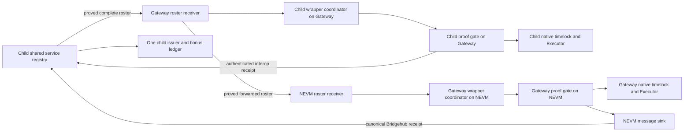

# zkSYS senior prover service V1

This is an opt-in implementation and release plan for one shared sequencer, senior
Sentry FRI workers, and independently endorsed SNARK wrapping for both the child
and Gateway chains. It is **not enabled by the
existing launch scripts**. It builds on the reproduced V32/V8 guest and production
verification key. The canonical fixture regeneration marker remains in force.
Contract tests with mock settlement prove accounting and authorization behavior;
they do not qualify a deployed Gateway or the packaged multi-role fixture.

## Agreed economics

The audited issuance curve and supply cap are unchanged. There is no new fixed
50% pool. Passive weight is native stake plus the existing 100,000 Sentry base
weight. An authenticated membership observation must establish at least 210,240
Core blocks of age before a Sentry can subscribe for proving service.

Registration and probation contribute **zero bonus weight** to the denominator.
Completing the configured quota of distinct, accepted, nonempty canonical batch
duties admits the account for a future period. The first senior tier has a 35,000
bonus; at 525,600 blocks the bonus is 100,000. Completing a quota is evidence of
accepted work, not proof of exclusive GPU ownership, independent control, or a
particular hardware capacity.

For an admitted period, the reward denominator is passive weight plus its frozen
admitted bonus total. A recipient's positive duties release only its own bonus
fraction. Missing bonus is never reassigned or minted later. A report cannot
remove another recipient, alter a frozen denominator, or erase earlier positives.
Membership removal stops future renewal while preserving already earned credit.
Removing an account from a **future** admission period can still increase future
shares. This design does not claim to remove that exclusion incentive or make a
single sequencer a fair dispatcher.

Period accounting is bounded and can be advanced in chunks. Passive claims are
independent of finalized service reports. If activation misses the first period,
an irreversible abort preserves passive accounting and native withdrawals and
permanently prevents late service bonuses for that configuration. The legacy
registry `weightOf` and `totalWeight` remain potential/legacy views; consumers of
service mode must use the issuer's effective reward views.

## Contract boundaries

`ZkSysMembershipRegistry.applyL1SentryNodeUpdates` consumes source block height
and timestamp sampled by the NEVM registry bridge. Older observations cannot
resurrect a removed node. This is the sole membership update API for the initial
deployment; there is no legacy update entrypoint. The observation mapping uses
one reserved proxy storage slot.

`ZkSysProverServiceRegistryV1` uses account-signed EIP-712 subscriptions, distinct
operator and beneficiary fields, a bounded period interval, and operator-signed
work receipts. A batch can supply at most one canonical duty credit; a slot cannot
be counted twice. Retry attempts and splitting an aggregate do not create another
credit for the same batch. An empty companion can settle, but earns no duty credit.

The child registry owns one enrollment, one quota bitmap per account and period,
and one bonus admission ledger for both execution chains. Each lane has an
immutable chain ID, settlement diamond and production VK; the configured shared
sequencer is required in every subscription and package. Canonical batch dedup
includes its execution chain and diamond, while quota slots are shared across
chains. A child duty and a Gateway duty may complete one quota; they cannot reuse
the same slot or create a second bonus pool. Bootstrap Gateway proofs never
overwrite the child's production VK pin. The optional child-only configuration
uses zero Gateway fields; a foundational Gateway deployment must enable both.

Only the local immutable acceptance adapter can install accepted reports. Child
proof acceptance comes from the child's fixed gate on Gateway through the existing
interop message verifier at `0x10009`. Gateway proof acceptance comes from its
fixed gate on NEVM: `ZkSysRootServiceMessageSinkV1` records that gate's message in
the same transaction, and anyone can pay the canonical Bridgehub relay to the
child receiver. The receiver requires the root sink's canonical alias and exact
lane, policy and report bindings. An address comparison across chains or a signed
post-proof attestation cannot replace either path. Root relay retries do not add
credit. Bootstrap and service activation have separate authenticated domains.

Each settlement chain runs its own full `ZkSysProofGateV1`, priority guard and
wrapper coordinator. The NEVM gate has the same joint sequencer/wrapper
authorization and native proof binding as the child's gate on Gateway. It is the
sole configured timelock prover for Gateway and runs Gateway's native verifier
exactly once. Both native proof lanes contribute to the same child accounting.

The child computes a complete, sorted wrapper roster from qualified accounts that
subscribed for wrapping. Paginated publication is permissionless and cannot omit
qualified accounts or substitute an operator/payee. Admission closes ahead of
the period so the roster can be proved to Gateway and its root entropy prepared.
This cutoff and the receipt grace must cover measured cross-chain proof latency.

An account that previously completed a full quota for this sequencer can renew
its wrapper subscription during an idle period, provided its senior membership
is still fresh. Renewal adds no bonus admission, success credit, or denominator
weight. This keeps capable verified wrappers available when sparse demand has not
produced another FRI quota. A newcomer or a partial qualifier cannot use renewal.
Roster messages bind the issuer clock and first service period as well as the
chain, registry, policy, root, and count.

`ZkSysQualifiedRosterReceiverV1` first verifies the child registry's roster message
on Gateway. Its permissionless forwarding call emits that exact origin payload
through Gateway's native messenger. A second receiver on NEVM verifies the fixed
Gateway receiver's message against Gateway's native Mailbox. It cannot accept an
unproved root or substitute a different clock. Both coordinators select from the
same complete qualified roster, with independent domain-bound draws and counters.

`ZkSysRootDrawV1` first verifies the Gateway coordinator's canonical message, then
sets a target relative to the **actual NEVM block number**. A delayed relayed head
cannot substitute for this causal ordering. Anyone may capture the result after
the configured confirmations and relay it to the aliased Gateway receiver. The
root source cannot replace a captured result. At least one independent keeper
must capture each available result before the 256-block `blockhash` window expires.
If all keepers selectively withhold capture, expired-draw recovery permits bias.
Native PoW producer bias also remains; these contracts do not verify ChainLocks.

The Gateway coordinator already executes on NEVM and uses
`ZkSysNativeRootDrawV1` directly. Only that fixed coordinator can request a draw;
its target is a future actual NEVM block, with the same immutable capture and
expired-uncaptured retry rules. This removes an unnecessary message round trip
without creating an owner-controlled randomness oracle.

The coordinator prepares one draw per fixed service roster. For each package it
uses the period seed and a counter that advances only on acceptance. Manifest,
range, and retry edits cannot change the current draw. Timed turns walk the fixed
roster without repeats until all candidates have had a turn, then cycle again.
The selected operator and sequencer endorse the same typed package with fixed
beneficiaries. Anyone can relay it. A repair replaces frozen work commitments
while keeping the counter, selected schedule, and original turn clock.

Activation requires both gates' authenticated activation messages, the exact
first-period roster root, and each lane's production VK before the child deadline.
Until both arrive, the child service remains inactive and all bonus weight stays
zero. A missed deadline permanently preserves passive accounting through the
issuer's existing abort path. The root gate's activation transaction is not enough:
its Bridgehub message must actually reach the child before the deadline.
At least one authenticated child bootstrap receipt must establish the child's VK
before activation; its report may be empty if all qualifying duties came from
Gateway. Gateway qualification cannot establish or overwrite that child pin.

The first roster is transported by native bootstrap proofs before coordinator
installation. After a gate activates, its ready first roster may jointly authorize
proofs before the first paid period starts, allowing those proofs to carry the
activation message. At rollover, `openingRoster()` always prefers the ready
current roster. If that roster or draw is still in transit, it selects the newest
cached ready past roster for recovery proofs. A future draw cannot hide a usable
past roster. These proofs can transport the next roster, draw or priority request,
so proving does not depend on a message that requires that same proof to arrive.

The gate freezes `transitionWork` when opening any such prestart or recovery
package. Its report must remain empty through repair and submission, even if a
period boundary passes before completion. Native transaction-bearing batches may
still be proved, but the gate emits no accepted-reward message for that package.
It advances the canonical parent, priority cursor and wrapper counter normally.
Once the current roster and draw arrive, the next package resumes ordinary work
credit. A complete lack of any qualified roster still prevents activation; stale
recovery wrappers preserve proving availability without renewing their bonus.

`ZkSysProofGateV1` accepts only the V32/V8 production proof lane, pins the verifier
router and its selected PLONK implementation, and rejects testnet proof mode. It
checks exact proof calldata, the full native BatchOutput preimages, canonical
transaction counts, batch statements, report hash, parent, range, and both
endorsements. It then invokes the existing timelock/Executor proof verification exactly once.
The adapter checks authorization and public-data bindings; it does not perform
an additional cryptographic proof verification.
Any failure rolls back coordinator acceptance and produces no accepted receipt.
Commit/execute ordering, execution delays, and native withdrawal proofs stay in
their existing contracts.

`ZkSysRootPrioritySourceV1` reads the child's canonical NEVM Mailbox priority tree
and its existing request timestamps. The pinned native patch exposes two read-only
getters for request timestamps and exact tree height; it changes no guest state,
proof statement, or verification key. It does change the native facet and selector
identities, so deployment cuts must be derived from the current combined source.
Inherited crypto-validation records retain their original source scope and do not
certify that new deployment. Anyone can pay to relay a checkpoint through
the existing Bridgehub to `ZkSysPriorityCheckpointReceiverV1` on Gateway. Only the
canonical alias of that immutable root source can install a checkpoint. The source
finds the overdue prefix by a bounded binary search over native append-order
timestamps. Requests present before source deployment must drain before the guard
starts, since timestamp coverage begins at its immutable deployment cursor.

The mandatory `ZkSysPriorityGuardV1` freezes a fresh authenticated checkpoint when
the sequencer opens each bootstrap or service package. Bootstrap submission now
requires `openBootstrapPackage` with a zero proof hash before proving. The guard
requires the next bounded overdue prefix, capped by its immutable package limit,
and permits younger requests already covered by that checkpoint. A permissionless
`publishPrefixWitness` call proves the contiguous priority-tree leaves and binds
their exact per-batch counts and native rolling hashes. The gate compares those
bindings with the existing native BatchOutput preimages, then calls native proof
verification once. Failed native verification rolls back both guard and wrapper
acceptance. The guard advances a separate verified priority cursor so delayed
execution cannot credit the same prefix again.

Later queue arrivals do not invalidate an in-flight proof. Work expires after the
immutable proof window; `refreshPriorityCheckpoint` then requires a fresh root
checkpoint and new prefix witness while retaining the wrapper clock and selection.
An empty package remains legal only when the frozen overdue requirement is empty.
Snapshot freshness, inclusion delay, proof duration, and the per-package cap are
explicit deployment policy. A backlog drains in ordered bounded chunks as packages
are proved; this is a progress condition, not a wall-clock inclusion guarantee.
The rule covers root priority requests, not ordinary off-chain mempool submissions.

The Gateway gate's guard reads a second `ZkSysRootPrioritySourceV1` directly on
NEVM, scoped to Gateway's own canonical Mailbox. The child guard continues to use
the authenticated checkpoint receiver on Gateway. Each lane has its own verified
cursor, native tree witness and bounded overdue prefix; the shared reward quota
does not merge priority queues or duplicate native verification.

In the Gateway topology, root priority requests may be overdue before Gateway has
forwarded them to the child Mailbox. The guard sees the root checkpoint and stops
child proof progress until a valid prefix can be included. It cannot compel the
parent Gateway sequencer to forward requests or checkpoints. Missing keepers,
withheld checkpoints, unavailable root proofs, and unavailable Gateway delivery
therefore fail closed. Production qualification must exercise these message paths
and the oldest-request backlog under real root/Gateway delays.

The gate requires itself to be the only timelock `PROVER_ROLE` member. That is
**not** a proof that the diamond has no other validators: its validator mapping
is not enumerable. Deployment must audit every validator assignment, alternate
timelock, permissionless validator, and emergency path. Chain upgrade and
verifier governance remain trusted authorities. Do not advertise joint
authorization unless the complete deployed bypass audit passes.

## Trusted operator and rental boundaries

`scripts/prover-rental` contains a Runpod v2 controller, a concrete one-job image
adapter for the existing FRI/SNARK CLI, and a trusted Sentry lease handoff. Tests
exercise both stages through a mocked provider and node. Defaults are dry-run;
the policy intentionally has no guessed hardware, runtime, price, image, or CUDA
values. An independently supervised watchdog and durable journal are required
before live creation. Ambiguous creation is reconciled without a second POST.

The rented GPU receives an immutable hash-pinned payload and narrowly scoped
object capabilities. The genuine sequencer lease, account keys, endorsement keys,
and Runpod key remain on the trusted host. Returning a file with the right hash
does not establish proof validity. The trusted Sentry resubmits the returned bytes
with the retained lease through the existing verifier-backed API and preserves
them across nonterminal responses.

`scripts/prover-service` prepares portable manifests and exact typed wallet
requests from independently obtained EN/native proof evidence. Rust V1 bindings
share the Solidity encodings. These tools do not transform diagnostic `prover_id`
strings or Basic Auth into on-chain Sentry identity. The current v1 API remains a
compute lease API.

The opt-in `dispatcher.py` adapter now uses that API on the trusted sequencer
host. It verifies account-signed subscriptions, operator bindings, fresh senior
membership and deployment parameters at one finalized child-chain block. It
checks its supplied accounts against the complete on-chain FRI enrollment
enumeration at that block, with explicit eligibility exclusions for stale or
removed members, then authenticates per-job operator readiness with EIP-712. A protected, exclusively
locked journal assigns nonempty native batches in sorted per-account round-robin
order, retaining cursor, slots, exact leases, signed offers and retry history.
Both execution queues share that account cursor and quota bitmap. Enrollment and
readiness use the child registry domain; native batch statements and proof
packages use the selected lane's execution and settlement domains. A retry stays
in its original lane and cannot consume a second quota slot through the other
queue.
Only verifier-backed FRI acceptance or recovery of the identical retained proof
and metadata can produce an accepted duty. Safe exports omit BasicAuth and lease
capabilities. The adapter is an EOA/file-handoff workflow with one journal per
sequencer/period/phase, not a public worker server. Its fixed snapshot is bounded
to 256 enrolled accounts and 2,000 retained attempts. The entire eligible roster's
quota must fit that attempt limit; initialization rejects
an impossible assessment. Reserve additional retry capacity operationally.
Enrollment and quota sizing against the actual network are release requirements.
Enrollment must precede initialization; later applicants wait for the next assessment snapshot
and receive no failure mark. An active journal must never be reset to add them. A trusted sequencer can still omit
readiness requests or withhold delivery, so fairness assumes honest operation of
this dispatcher and its authenticated handoff transport.

No job, unsigned reservations and empty work do not count as offered service.
The journal reports genuine signed opportunities separately from native proof
successes and indicates whether each account received its full quota. Sparse
demand creates neither synthetic failures nor admission credit. The bonus lane
continues to require the specified genuine accepted work; protocol-level policy
for comparing availability under insufficient demand remains a launch decision.

The read-only `/v1/SNARK/{from}/{to}/evidence` endpoint exports canonical stored
batch/output preimages from retained proof metadata. It has the existing bounded
peek admission, checks contiguous V32/V8 identities, and refuses the zero VK
sentinel. It exports neither lease capabilities nor raw proofs. This is producer
evidence to compare with independently executed EN results; it is not itself an
independent EN verification. `ProofCommand::service_submission` validates a
completed sidecar against its exact retained native metadata and proof bytes and
constructs the gate call.

The node's opt-in `service_publication` configuration replaces its proof sender
with a durable external-wallet handoff on each execution lane. It writes the
exact native proof bytes, batch outputs and reviewed deployment pins to a private
`work.json`. After a relayer returns a matching `relay.json`, the node reconstructs
the exact gate call and verifies its successful transaction, acceptance event,
historical contract code and configuration, canonical block and configured
confirmation depth before advancing those batches to native execution. A file
or a native proved frontier alone cannot authorize advancement. Recovery retains
the original proof until this same receipt check succeeds. Commit and execute
remain in their existing pipeline stages; the service proof sender needs no
node-owned proof wallet. Bootstrap uses zero coordinator pins. When the reviewed
coordinator is later installed, recovery preserves each outstanding bootstrap
record's original bytes and zero pins while checking its unchanged gate, policy,
VK and native proof identity.

The opt-in `relay.py` consumes that exact native payload and completed sidecar.
It pins the reviewed gate/coordinator code and reads phase, parent, frozen work,
wrapper index/turn, deadline and signing domain at one canonical settlement
block before simulating the exact gate call. Wallet signing and broadcast require
explicit execution. The raw signed transaction and its deterministic hash are
durable before sending; restart only reconciles or rebroadcasts those same bytes.
Stale work is not reendorsed, and another relayer's acceptance does not release a
still-pending local wallet nonce. Receipt events and canonical confirmations
complete the journal. This is a trusted-wallet RPC handoff with a dedicated nonce
journal. Its handoff export connects the confirmed wallet journal to the node's
retained work; it does not bypass the node's independent receipt check.

`keeper.py` prepares and simulates unsigned package opening, repair and fixed
maintenance calls. For external service SNARK work it validates the actual native
commitments, frozen package, selected wrapper, current turn and priority witness
before producing a compute permit. The rental pool pins the lane's keeper
configuration and revalidates that permit before launch, then checks that the
runtime and reserve still fit the deadline immediately before provider creation.
Selected-wrapper keys and native leases remain on trusted hosts. A provider can
still start late or fail, and a competing state change can invalidate work after
the last check; these checks do not guarantee paid work or a provider invoice cap.

The [keeper operator guide](https://github.com/syscoin/zksync-os-server/blob/0156211b1ff3dc827a65eccff716eba9cf6c977e/scripts/prover-service/keeper-operator-guide.md)
describes the trusted sequencer lease, independent evidence, selected wrapper,
pool output, native SNARK submission, wallet and node handoff. The keeper produces
reviewable unsigned calls; operators must supply actual native cross-chain proofs,
sign and submit required calls, and supervise message capture and delivery.
Prestart and rollover control packages require empty duty reports, so their FRI
compute must not consume the dispatcher's paid assessment slots. Their ordinary
compute costs do not create service credit.

## Release gates still requiring completion

1. Qualify the deployed service contracts against the reproduced V32/V8 guest,
   production verifier and compiled VK, preserving the release's exact source
   and generated-artifact checks. Separately complete atomic canonical fixture
   regeneration and snapshot/restore acceptance. The fixture marker, unset
   binding and empty trusted-descriptor registry continue to prohibit packaged
   fixture certification; ordinary deployment-source materialization does not
   require that fixture or certify a service launch.
2. Exercise the authenticated dispatcher with the real enrolled roster, native
   verifier, and operator delivery transport. Admission and renewal cannot be
   treated as a fair availability assessment until genuine usable duties are
   offered to the full roster. The implemented journal exposes sparse demand
   without declaring failure; finish the protocol-level assessment policy before
   making availability or penalty claims. No enrollment or synthetic workload
   can qualify a service account.
3. Exercise the implemented selected-wrapper/EN sidecar and durable relayer with
   the reviewed production wallet RPC and deployed gate. Mocked tests cover stale
   turns, repaired manifests, process crashes, ambiguous sends, receipt replay
   and restart after acceptance; qualify real Gateway roots, native-proof gas,
   nonce ownership and confirmation policy before enabling that publication lane.
   No in-flight transaction authorization may be replaced blindly.
4. Exercise both real child/Gateway/NEVM proof lanes, complete roster publication
   and forwarding, both period draws, both accepted-receipt paths, and both
   activation messages before the child deadline. Qualify bootstrap transport and
   nonrewarded prestart/rollover recovery packages with actual native messages.
   Measure the lead/grace windows and run independent root capture and relay
   keepers. Prove that either missing activation cannot lock passive principal.
5. Qualify the implemented root-priority guard against real NEVM/Gateway queues,
   including checkpoint delivery, delayed root-request forwarding, prefix witness
   construction, expired-proof recovery, and backlog drain. Deploy the patched
   native timestamp/tree-height getters and prove that existing requests are
   drained before activating the guarded lane. Contract tests alone do not
   establish parent-Gateway inclusion or a deployed deadline guarantee.
6. Perform the deployed validator/prover/emergency-path audit and production
   verifier integration test. Preserve all native final withdrawal checks.
7. Qualify the final hardware and immutable image, including cold setup, FRI,
   combination/compression, wrapping, artifact return, and forced termination.
   Provider outages can prevent termination; software budgets are not an absolute
   provider invoice cap. No real rental or GPU proof was run by these unit tests.
8. Test sequencer/EN checkpoint recovery and Gateway unsettled-history recovery.
   The launch still has one producer and no multi-sequencer fork choice. Ordinary
   RPC receipts and fast interop retain their existing provisional-history
   assumptions.

Native transaction fees still go to the current collector. No fee split, burn to
native SYS conversion, new bounty, new slashing rule, or standing GPU subsidy is
introduced. Those changes require separately specified accounting.

## Review scope

The implementation review covers token mint/cap authority, issuer schedule and
budget accounting, passive/service separation, reward registry callbacks, native
staking withdrawal liveness, membership ordering, report replay/deduplication,
draw causality, wrapper repair/rotation, both gates' proof/statement bindings,
shared cross-chain quota accounting, and nonrewarded control-proof recovery.
Reserved proxy storage layouts are preserved. Existing versioned replay wire
formats and the guest are unchanged. This is an engineering review with focused
regression tests, not an independent third-party security audit or launch signoff.
